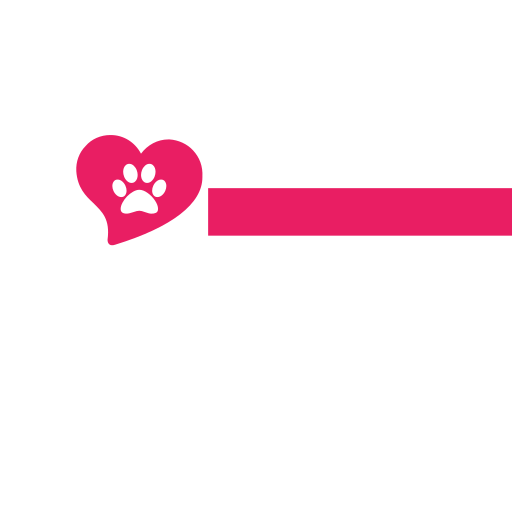

    

# Happier - web application

The application was designed to supports the adoption process for animals from shelters.

- demo available at [happier-pet.life](https://happier-pet.life)

## Technology stack

React, Gatsby, Styled-components and Firebase.

Methodologies: Atomic Design and Mobile First Design.

## Key features

- Advanced search for pets
- Autogenerated pages for all available pets in database
- Users authentication, roles and user panels (demo users available):
  - admin - in admin panel user can add the role of institution to the selected animal shelter
  - institution - in institution panel user can add, update and delete pets
  - common user - in user panel user can add and delete pets from his favourities
